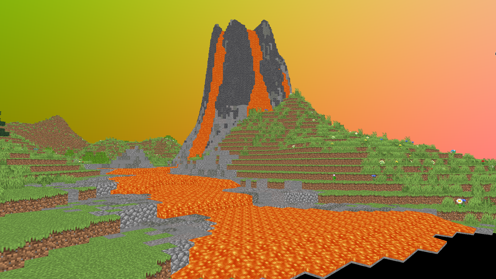
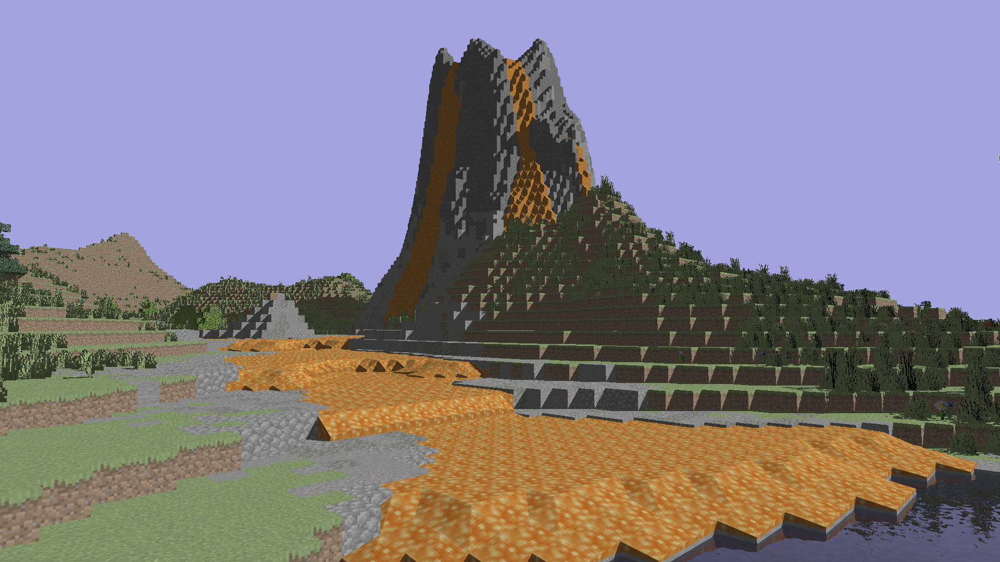

# Triffois Raytracer

A raytracer with shadows, reflection, refraction, model and texture loading (using GLTF format) and a subset of physically based rendering and global_illumination.

The languages used are C++, OpenGL and GLSL.

# Showcase

Here are some scenes rendered using our raytracer:


# Technical Report

You can view our technical report at https://www.overleaf.com/read/mzgnkhkjzgjw#ead516

> A ray tracer is an algorithm used to generate 3D images by
simulating how light rays travel and interact with virtual ob-
jects and surfaces. It traces the paths of imaginary light rays as
they bounce off or pass through objects in a scene, calculating
the colors and shading based on material properties, lighting
conditions, and camera position.

# Compilation

## Requirements

In our experience, we needed to install additionally (fedora linux 40):

- wayland-devel
- libxkbcommon-devel
- mesa-libGL-devel
- glm-devel

## Linux, wayland

```bash
mkdir build
cd build
cmake -DGLFW_BUILD_WAYLAND=ON -DGLFW_BUILD_X11=OFF -DCMAKE_BUILD_TYPE="Release" -DCMAKE_INSTALL_PREFIX=".." ..
cmake --build .
cmake --install .
```

## Linux, X server

```bash
mkdir build
cd build
cmake -DGLFW_BUILD_WAYLAND=OFF -DCMAKE_BUILD_TYPE="Release" -DCMAKE_INSTALL_PREFIX=".." ..
cmake --build .
cmake --install .
```

# Usage

From the root of the project run the commands below. You can move:
- forward, using `w`
- backward, using `s`
- left, using `a`
- right, using `d`
- up, using `space`
- down, using `shift`

By default, you can rotate the camera using mouse, but if it does not work well, there are instructions below to switch to arrows.

The general command is:

```bash
./bin/MYOWNRAYTRACER <path_to_shader_file> <path_to_model_file>
```

As of June 11, 2024 the latest shader is `structured/global_illumination.glsl` (which can be found in the `shader_experiments` repository). It is one of the slowest too, though. If you want to test more lightweight shaders, you can try:
- multibounce - it is a version prior to global illumination - almost as slow as `global_illumination`
- moving - it is a version prior to refractions and reflections - recommended, if speed is an issue
- basic - same as above, but without the moving ability. It will just rotate around the center of the scene

Differences between these shaders will be shown in the end of this document.

If you are using nvidia's proprietary drivers on Linux, you would add `__NV_PRIME_RENDER_OFFLOAD=1 __VK_LAYER_NV_optimus=NVIDIA_only __GLX_VENDOR_LIBRARY_NAME=nvidia` at the very beginning of the command to run using GPU.

## To load a gltf or glb model

```bash
./bin/MYOWNRAYTRACER <path_to_shader_file> <path_to_gltf_or_glb_file>
```

Note: our raytracer only supports models with triangles as primitives. Therefore, you would triangulate your models first before passing to the raytracer.

## To load multiple models

```bash
./bin/MYOWNRAYTRACER <path_to_shader_file> <path_to_gtlf_file1> <path_to_glb_file1> <path_to_gtlf_file2> <path_to_gtlf_file3> ...
```

## To specify camera rotation style

You would provide `mode=mouse` or `mode=arrows` as the last argument, after all your models.

### To rotate camera using arrows on the keyboard (Default)

```bash
./bin/MYOWNRAYTRACER <path_to_shader_file> <path_to_gltf_file> mode=mouse
```

### To rotate camera using arrows on the keyboard

Useful for wayland, which does not allow to just place the cursor at the center of the screen and therefore constantly rotates the camera.

```bash
./bin/MYOWNRAYTRACER <path_to_shader_file> <path_to_gltf_file> mode=arrows
```

# Shaders

## Basic

`structured/basic.glsl`

It is just a simple shader that colors the objects based on their textures.

This shader does not provide moving abilities either, so the camera will just rotate around the center of the scene.

It can be useful to showcase a model from different angles.

## Moving

`structured/moving.glsl`

This shader is the same as the basic one, but it allows the camera to move around the scene.



## Multibounce

`structured/multibounce.glsl`

This shader is the same as the moving one, but reflections, refractions and shadows are calculated.



## Global Illumination

`structured/global_illumination.glsl`

This shader shoots multiple rays randomly per pixel to calculate the global illumination (so that there are darker and lighter areas of shadows).

However, it is the slowest shader we have, and we already made a few sacrifices to image quality to make it faster.


# Sources that were helpful for us

https://doi.org/10.1145/965141.563893

https://doi.org/10.1080/10867651.1997.10487468

https://docs.blender.org/manual/en/latest/render/cycles/index.html

https://irendering.net/why-octane-is-a-perfect-render-engine-for-cinema-4d/

https://docs.otoy.com/cinema4d/AboutOctaneRender.html

https://garagefarm.net/blog/redshift-biased-rendering

https://help.maxon.net/r3d/houdini/en-us/index.html

https://github.com/syoyo/tinygltf

https://github.com/huamulan/OpenGL-tutorial/tree/master

https://github.com/emeiri/ogldev/tree/master

